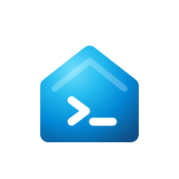

<p align="center">
  <a href="https://fdw.debruyn.dev">
    
  </a>
</p>

# fabric-dw

> Python CLI and MCP server for administering Microsoft Fabric Data Warehouses and SQL Analytics Endpoints.

## Status

**Alpha — work in progress.** The API and CLI interface may change without notice. See the [open issues](https://github.com/sdebruyn/fabric-dw-mcp-cli/issues) for current status.

## Description

`fabric-dw` provides two interfaces for managing Microsoft Fabric Data Warehouses and SQL Analytics Endpoints:

- **CLI** — a command-line tool for common DW administration tasks.
- **MCP server** — a [Model Context Protocol](https://modelcontextprotocol.io) server that exposes DW operations as tools for AI assistants.

Authentication is configured via the `FABRIC_AUTH` environment variable. The default (`FABRIC_AUTH=default`) uses [`azure-identity` `DefaultAzureCredential`](https://learn.microsoft.com/python/api/azure-identity/azure.identity.defaultazurecredential?WT.mc_id=MVP_310840), which walks environment variables, Workload/Managed Identity, and the Azure CLI token cache in order. For most local usage, `az login` is all you need. See the [Authentication](https://fdw.debruyn.dev/install/#authentication) docs for the full credential chain and alternative modes.

## Installation

```bash
pip install fabric-dw
```

> Note: placeholder release; CLI/MCP under active development. Installation instructions will be updated on first release.

## Run in Docker

```bash
docker pull ghcr.io/sdebruyn/fabric-dw:latest
docker run --rm \
  -e AZURE_CLIENT_ID=… \
  -e AZURE_TENANT_ID=… \
  -e AZURE_CLIENT_SECRET=… \
  -e FABRIC_AUTH=sp \
  ghcr.io/sdebruyn/fabric-dw --help
```

Dev images (built from every main merge): `ghcr.io/sdebruyn/fabric-dw:main` or `:<version>.dev<N>`.

Package page: [ghcr.io/sdebruyn/fabric-dw](https://github.com/sdebruyn/fabric-dw-mcp-cli/pkgs/container/fabric-dw)

## Quick Start

### CLI

```bash
# Coming soon
fabric-dw --help
```

### MCP Server

```json
// Coming soon — add to your MCP client configuration
{
  "mcpServers": {
    "fabric-dw": {
      "command": "fabric-dw-mcp"
    }
  }
}
```

## Develop in a container

Open the repo in [GitHub Codespaces](https://github.com/codespaces) or VS Code's Remote-Containers extension — the devcontainer pre-installs Python 3.13, uv, Azure CLI, and the GitHub CLI.

[](https://codespaces.new/sdebruyn/fabric-dw-mcp-cli)

## Contributing

See [CONTRIBUTING.md](CONTRIBUTING.md) for dev setup, branch flow, and how to run tests locally.

📖 Docs: [fdw.debruyn.dev](https://fdw.debruyn.dev) (or run `uv run --only-group docs zensical serve` locally).

## Security

Please report vulnerabilities privately — see [SECURITY.md](SECURITY.md).

## Code of Conduct

This project follows the [Contributor Covenant 2.1](CODE_OF_CONDUCT.md).

## License

[MIT](LICENSE) — Copyright (c) 2026 Sam Debruyn
