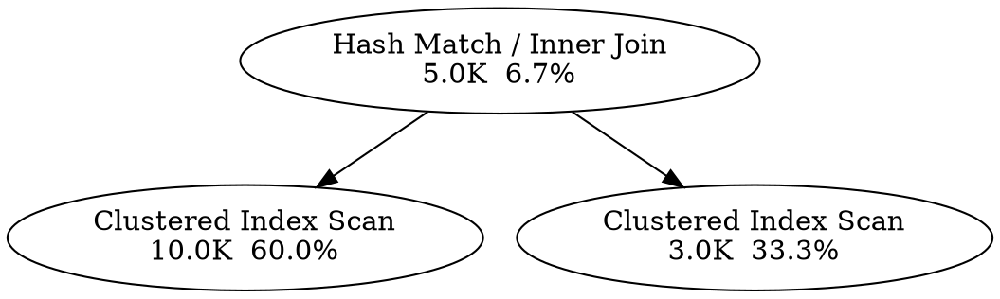

# Running SQL

SQL execution and query-plan capture against a Fabric Data Warehouse or SQL Analytics Endpoint.

**Targets:** Data Warehouse · SQL Analytics Endpoint

---

## CLI

### sql exec

Execute a SQL statement or file against a warehouse or SQL Analytics Endpoint. Provide the query via `-q`/`--query` or `-f`/`--file` (not both). Multi-statement batches are supported; only the last result set is returned. DDL/DML statements return empty columns and rows.

!!! warning

    This command executes arbitrary SQL, including DDL and DML. Ensure you have the correct target before running destructive statements.

**Synopsis**

```
fdw [-w WORKSPACE] sql exec [OPTIONS] [ITEM]
```

| Option | Description |
| --- | --- |
| `-q` / `--query TEXT` | SQL statement or batch to execute inline. |
| `-f` / `--file PATH` | Path to a `.sql` file to execute. UTF-8 and UTF-8 BOM files are both supported. |

Output defaults to a Rich table (rows/columns). Pass `--json` on the root command to emit machine-readable JSON (`{"columns": [...], "rows": [...], "rowcount": N}`).

**Example**

```shell
# Inline query, Rich table output (default)
fdw -w MyWorkspace sql exec SalesWH -q "SELECT TOP 5 * FROM dbo.Sales"

# File input, JSON output
fdw -w MyWorkspace --json sql exec SalesWH -f ./queries/report.sql
```

```json
{"columns": ["id", "name"], "rows": [[1, "Alice"], [2, "Bob"]], "rowcount": 2}
```

---

### sql plan

Capture the **estimated** SHOWPLAN_XML execution plan for a SQL statement without executing it. The query is **not** run — only the plan is returned. This means DDL/DML query text is safe to plan without modifying any data.

By default the plan is rendered as a **Rich terminal tree**: each operator is shown with its physical/logical op name, estimated row count, cost percentage (colour-coded), and badges for parallel execution or warnings. For multi-statement batches, one tree is printed per statement.

The plan XML uses the standard namespace `http://schemas.microsoft.com/sqlserver/2004/07/showplan` and can be opened in SSMS or Azure Data Studio.

**Synopsis**

```
fdw [-w WORKSPACE] sql plan [OPTIONS] [ITEM]
```

| Option | Description |
| --- | --- |
| `-q` / `--query TEXT` | SQL statement to plan. |
| `-f` / `--file PATH` | Path to a `.sql` file to plan. |
| `-o` / `--output PATH` | Write the output to this file (stdout otherwise). For raw XML a `.sqlplan` extension is recommended; for `--format mermaid` or `--format dot` any text extension works; for `--format svg` a `.svg` extension is recommended. |
| `--raw` / `--xml` | Print the raw SHOWPLAN XML to stdout (or to `-o` file). Useful for piping or inspection. |
| `--format [mermaid\|dot\|svg]` | Export format for the execution plan. See [Export formats](#export-formats) below. |

Pass the root `--json` flag to emit the parsed operator tree as machine-readable JSON instead of the Rich tree.

**Representation vs. destination** — these two axes are orthogonal:

| | no `-o` | `-o FILE` |
| --- | --- | --- |
| `--raw` / `--xml` | raw XML to stdout | raw XML to file |
| `--json` (root flag) | JSON to stdout | JSON to file |
| `--format mermaid` | Mermaid diagram to stdout | Mermaid diagram to file |
| `--format dot` | DOT digraph to stdout | DOT digraph to file |
| `--format svg` | SVG image to stdout | SVG image to file |
| default | Rich tree to terminal | raw XML to file, no tree rendered |

When `-o` is given, only a short confirmation is printed to stdout; the representation itself goes to the file only.

**Example**

```shell
# Default: render a Rich terminal tree in the console
fdw -w MyWorkspace sql plan SalesWH -q "SELECT TOP 5 * FROM dbo.Sales"

# Save raw plan XML to file (opens in SSMS / Azure Data Studio)
fdw -w MyWorkspace sql plan SalesWH -q "SELECT TOP 5 * FROM dbo.Sales" -o plan.sqlplan

# Print raw SHOWPLAN XML to stdout (pipe-friendly)
fdw -w MyWorkspace sql plan SalesWH -q "SELECT TOP 5 * FROM dbo.Sales" --raw

# Emit the operator tree as JSON to stdout
fdw -w MyWorkspace --json sql plan SalesWH -q "SELECT TOP 5 * FROM dbo.Sales"

# Save the operator tree as JSON to a file (no stdout output)
fdw -w MyWorkspace --json sql plan SalesWH -q "SELECT TOP 5 * FROM dbo.Sales" -o plan.json

# Emit a Mermaid flowchart diagram to stdout
fdw -w MyWorkspace sql plan SalesWH -q "SELECT TOP 5 * FROM dbo.Sales" --format mermaid

# Save a Mermaid diagram to file (no stdout output)
fdw -w MyWorkspace sql plan SalesWH -q "SELECT TOP 5 * FROM dbo.Sales" --format mermaid -o plan.md

# Emit a Graphviz DOT digraph to stdout
fdw -w MyWorkspace sql plan SalesWH -q "SELECT TOP 5 * FROM dbo.Sales" --format dot

# Save a DOT graph to file and render to SVG (requires Graphviz)
fdw -w MyWorkspace sql plan SalesWH -q "SELECT TOP 5 * FROM dbo.Sales" --format dot -o plan.dot

# Render the plan directly to SVG via the system dot binary (requires Graphviz)
fdw -w MyWorkspace sql plan SalesWH -q "SELECT TOP 5 * FROM dbo.Sales" --format svg -o plan.svg
```

#### Export formats

##### svg

`--format svg` renders the execution plan to an **SVG image** by piping the generated DOT through the system `dot` binary (`dot -Tsvg`).

!!! note "System dependency"

    This format requires [Graphviz](https://graphviz.org/download/) to be installed on your system — it is **not** a Python package.  Install it via your package manager (e.g. `brew install graphviz` on macOS, `apt install graphviz` on Debian/Ubuntu) or download it from [graphviz.org](https://graphviz.org/download/).

    When the `dot` binary is not found, the command exits with a clear error and an install hint rather than crashing.

A `.svg` extension is recommended for the `-o`/`--output` file.  SVG can be opened directly in any web browser or vector graphics editor.

---

##### dot

`--format dot` renders the execution plan as a [Graphviz](https://graphviz.org/) `digraph` (plain text, no extra Python dependencies).

Each operator appears as a node labelled with its physical op name (and logical op when different), the humanised estimated row count, and the cost percentage.  Parent→child edges show the data flow.  One `digraph` block is emitted per statement in the batch, separated by a blank line.

**Viewing the output**

- Pipe the output to `dot -Tsvg -o plan.svg` (requires [Graphviz](https://graphviz.org/) installed locally).
- Paste into an online viewer such as [Graphviz Online](https://dreampuf.github.io/GraphvizOnline/) for an interactive preview.

**Example output**



---

##### mermaid

`--format mermaid` renders the execution plan as a [Mermaid](https://mermaid.js.org/) `flowchart TD` diagram (plain text, no extra dependencies).

Each operator appears as a node labelled with its physical op name (and logical op when different), the humanised estimated row count, and the cost percentage.  Parent→child edges show the data flow.  One `flowchart TD` block is emitted per statement in the batch, separated by a blank line.

**Viewing the output**

- Paste the diagram text into [mermaid.live](https://mermaid.live) for an interactive preview.
- GitHub Markdown renders Mermaid natively inside a fenced code block:

  ````markdown
  ```mermaid
  flowchart TD
      S0N0["Hash Match / Inner Join\n5.0K  6.7%"]
      S0N1["Clustered Index Scan\n10.0K  60.0%"]
      S0N2["Clustered Index Scan\n3.0K  33.3%"]
      S0N0 --> S0N1
      S0N0 --> S0N2
  ```
  ````

---

## MCP tools

### execute_sql

**Targets:** Data Warehouse · SQL Analytics Endpoint

Execute an arbitrary SQL statement or batch against a warehouse or SQL Analytics Endpoint.

!!! warning

    This tool executes arbitrary SQL, including DDL (DROP, ALTER, TRUNCATE) and DML (DELETE, UPDATE). Use only when the user explicitly requests data modification. Default to SELECT when the user's intent is read-only investigation.

Multi-statement batches are supported; only the **last** result set is returned. DDL/DML statements that produce no result set return `columns=[]` and `rows=[]`.

`datetime` and `Decimal` column values are pre-serialised to strings. `bytes`/varbinary columns are base64-encoded and their column names are suffixed with `__base64`.

**Parameters:**

- `workspace` (`str`) — workspace name or GUID.
- `item` (`str`) — warehouse or SQL Analytics Endpoint name or GUID.
- `query` (`str`) — SQL statement or batch to execute.

**Returns:** `{ "columns": list[str], "rows": list[list[Any]], "rowcount": int }` — `rowcount` is `-1` when the driver does not report a count.

---

### get_query_plan

**Targets:** Data Warehouse · SQL Analytics Endpoint

Capture the **estimated** SHOWPLAN_XML execution plan for a SQL query without executing it.

This tool does **not** execute the query — it only retrieves the estimated plan. Because no data is modified, this tool is permitted even when `FABRIC_MCP_READONLY=1`. DDL/DML query text is safe to plan without modifying any data.

The plan XML uses the standard namespace `http://schemas.microsoft.com/sqlserver/2004/07/showplan` and can be opened in SSMS or Azure Data Studio.

**Parameters:**

- `workspace` (`str`) — workspace name or GUID.
- `item` (`str`) — warehouse or SQL Analytics Endpoint name or GUID.
- `query` (`str`) — SQL statement to generate an estimated execution plan for.

**Returns:** `{ "plan_xml": str }` — the SHOWPLAN_XML string.
