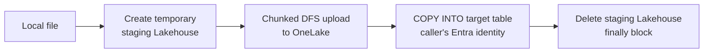

# Ingesting data

This guide walks through getting file-based data - CSV, Parquet, or JSON - into a Microsoft Fabric Data Warehouse table with `fabric-dw`, end to end: create the schema, create the destination table, stage and load the data via `COPY INTO`, verify the result, and refresh statistics. It covers both the CLI (`fdw …`) and the MCP server (for AI assistants).

It is task-oriented. For the full option reference of each command and tool, see the per-domain pages it links to: [Tables](../commands/tables.md), [Schemas](../commands/schemas.md), [Statistics](../commands/statistics.md), [Running SQL](../commands/sql.md), and the [MCP server](../install.md#mcp).

---

## When to use this guide

Use this guide when you have a target **Data Warehouse** and want to load file-based data into one of its tables.

!!! warning "SQL Analytics Endpoints are read-only"

    `COPY INTO` and table DDL (create / load / clear / statistics writes) are **Data Warehouse only**. SQL Analytics Endpoints are read-only here - listing, counting, and reading tables work, but you cannot create or load into them. If your `[ITEM]` is a SQL Analytics Endpoint the engine (or this tool) will reject the write.

Fabric offers several ingestion mechanisms. `COPY INTO`, what this tool uses, is Microsoft's recommended high-throughput, code-rich path for getting files into a warehouse. For scheduled low-code ingestion use **pipelines**, for code-free transforms use **dataflows**, and for in-warehouse moves use T-SQL (`INSERT … SELECT`, `SELECT INTO`, `CTAS`). See [Ingest data into a Fabric warehouse](https://learn.microsoft.com/fabric/data-warehouse/ingest-data?WT.mc_id=MVP_310840) for the full picture.

---

## Prerequisites

- `fabric-dw` installed - see [Install](../install.md).
- A working Azure credential. `fabric-dw` uses the Azure credential chain (Azure CLI, Managed Identity, service principal, environment variables). See [Authentication](../authentication.md).
- A target **Data Warehouse** in a Fabric workspace you can write to.
- `pyarrow` installed for the local-file, JSON, and schema-inference paths (local staging converts JSON to Parquet and infers schemas client-side). The remote-URL path does not need it.

!!! note "Command shape"

    The target workspace is a **global** option: `fdw -w <workspace> …`, falling back to your configured default. The warehouse is a positional `[ITEM]`. So every command below has the shape:

    ```
    fdw [-w <workspace>] <group> <command> [ITEM] …
    ```

    not `<command> <workspace> <item> …`. Once the [defaults](#set-your-defaults) are set, both `-w <workspace>` and the optional `[ITEM]` positional can be omitted (the examples below do).

---

## Decide your path

Two decisions shape the whole workflow:

**Where is the data?**

| Source | CLI | Notes |
| --- | --- | --- |
| Local file | `tables load … --file PATH` | Staged to a temporary Lakehouse in OneLake, then `COPY INTO`. CSV / Parquet / JSON. |
| Remote URL | `tables load … --url URL` | `COPY INTO` directly from the URL. CSV / Parquet only (JSON URLs are rejected). Must be HTTPS. |

**Does the table already exist?**

| Situation | Approach |
| --- | --- |
| Table exists | Create it first (Steps 1–2), then load (Step 3). |
| Table does not exist | Use `tables load … --create` to infer the schema from the source and create + load in one step (**local files only**). |

!!! warning "MCP cannot load local files"

    The MCP tools (`load_table_from_url`, `import_table_from_url`) are **remote-URL only**, and `create_empty_table` does not infer a schema from files. Local-file staging and file-based schema inference are **CLI-only**. From an AI assistant, either point at a remote/OneLake URL or run the local-file load from the CLI. See [Same workflow from MCP](#same-workflow-from-mcp-or-an-ai-assistant) below.

---

## Set your defaults

Store the workspace and warehouse once so you do not repeat them on every command:

```shell
fdw config set workspace MyWorkspace
fdw config set warehouse SalesWH
```

The rest of this guide assumes these defaults are set, so the examples omit `-w MyWorkspace` and drop the warehouse positional where it is optional. Any command still accepts an explicit `-w`/`--workspace` or a positional `[ITEM]` to override them. Commands that take a trailing required argument (such as `tables load … QUALIFIED_NAME`) keep the warehouse positional so the remaining arguments stay unambiguous. See [Configuration & defaults](../commands/config.md).

---

## Step 1 - (optional) create the schema

If your destination schema does not exist yet, create it. `dbo` always exists, so this step is only needed for custom schemas such as `staging` or `reporting`.

=== "CLI"

    ```shell
    fdw schemas create SalesWH staging
    ```

=== "MCP"

    Call `create_schema` with `workspace`, `item`, and `name`. `list_schemas` enumerates existing schemas; `delete_schema` is destructive and gated (see [statistics & destructive gating](#destructive-operations)).

See [Schemas](../commands/schemas.md) for the full reference.

---

## Step 2 - create the destination table

Skip this step if you plan to auto-create with `tables load --create` (see [Step 3](#step-3-load-the-data)). Otherwise create the table first - `COPY INTO` requires the destination table to already exist.

`tables create` (Data Warehouse only) has two modes:

- **Empty DDL**: scaffold the structure only; no data is read or inserted. Supply one of `--from-parquet`, `--from-csv`, `--from-json`, or `--column`.
- **CTAS** (`CREATE TABLE … AS SELECT`): populate the table from a query. Supply `--select` or `--from-file`.

=== "CLI"

    ```shell
    # Empty table, schema from a Parquet footer (no rows read)
    fdw tables create \
      --name dbo.sales \
      --from-parquet ./exports/sales.parquet

    # Empty table, schema inferred from a CSV header + sample
    fdw tables create \
      --name staging.raw_products \
      --from-csv ./data/products.csv --varchar-length 500

    # Empty table from explicit inline columns
    fdw tables create \
      --name dbo.events \
      --column "event_id:BIGINT:notnull" \
      --column "event_type:VARCHAR(100)" \
      --column "occurred_at:DATETIME2(7)"

    # Empty table, schema inferred from JSON data (JSONL or a JSON array of records)
    fdw tables create \
      --name dbo.audit_log \
      --from-json ./data/audit_log.jsonl --varchar-length 500

    # CTAS - populate from a query
    fdw tables create \
      --name dbo.orders_2026 \
      --select "SELECT * FROM dbo.orders WHERE YEAR(sale_date) = 2026"
    ```

    `--from-parquet`, `--from-csv`, `--from-json`, and `--column` are **mutually exclusive**: pick exactly one column source. `--from-json` infers the schema from a JSONL file or a JSON array of records (no rows are loaded into the table; use `tables load --format json` to load data afterwards). Add `--cluster-by COL` (repeatable, up to 4) to any create mode. See [tables create](../commands/tables.md#tables-create) for the full option table and the Arrow → T-SQL type mapping.

=== "MCP"

    - **`create_empty_table`**: explicit column list only: `columns: [{name, sql_type, nullable?}]`, optional `cluster_by`. Server-side file inference is intentionally **not** exposed; for file-based inference use the CLI `tables create --from-parquet` / `--from-csv` / `--from-json`.
    - **`create_table`**: CTAS: takes a `select_body`, optional `cluster_by`.

    See [create_empty_table](../commands/tables.md#create_empty_table) and [create_table](../commands/tables.md#create_table).

!!! tip "Prefer Parquet over CSV"

    Parquet is columnar, compressed, and supports column/row skipping, so it is faster for repeated reads and gives exact types on ingestion (CSV requires inference). Whatever method you use, the Parquet files Fabric writes are V-Order optimized - don't disable V-Order. See the [warehouse performance guidance](https://learn.microsoft.com/fabric/data-warehouse/guidelines-warehouse-performance?WT.mc_id=MVP_310840#data-ingestion-and-preparation-into-a-warehouse).

---

## Step 3 - load the data

`tables load` (Data Warehouse only) runs `COPY INTO`. Supply **exactly one** of `--file` (local) or `--url` (remote).

### Local file (`--file`)

A local file is staged to a **temporary staging Lakehouse** in OneLake, loaded with `COPY INTO` under your own Microsoft Entra identity, and the staging Lakehouse is then deleted automatically - even if the load fails.



Supported formats:

| Format | Local `--file` | How it is loaded |
| --- | --- | --- |
| CSV | yes | `COPY INTO` with `FILE_TYPE = CSV`. |
| Parquet | yes | `COPY INTO` with `FILE_TYPE = PARQUET`. |
| JSON | yes | Converted client-side to **Parquet** via `pyarrow`, then staged and loaded. |

!!! note "Local file size limit"

    Local files larger than **2 GiB** are rejected for staging. For larger data, upload the file to OneLake (or external storage) first and load it with `--url` instead.

```shell
# Load a local CSV into an existing table (header row present)
fdw tables load SalesWH dbo.sales --file data.csv

# Load a local Parquet file
fdw tables load SalesWH dbo.events --file events.parquet

# Load a local JSON file (converted to Parquet internally; requires pyarrow)
fdw tables load SalesWH dbo.products --file products.json
```

### Remote URL (`--url`)

`COPY INTO` runs directly against the URL - no staging Lakehouse is created. The URL must be **HTTPS** (link-local / instance-metadata hosts are rejected to prevent SSRF). Only **CSV and Parquet** are supported; JSON remote URLs are rejected - download the file and use `--file` instead.

For OneLake or same-tenant URLs no credential is needed (`COPY INTO` runs under your Entra identity). For secured external sources supply `--credential-type` and the matching secret/identity:

| `--credential-type` | Provide |
| --- | --- |
| `none` (default) | Nothing - uses your Entra identity. |
| `sas` | `--secret <SAS token>` |
| `account-key` | `--secret <account key>` |
| `managed-identity` | `--identity <identity>` |
| `service-principal` | `--identity <client id>` + `--secret <client secret>` |

```shell
# Load from a remote OneLake URL (no credential needed)
fdw tables load SalesWH dbo.orders \
    --url "https://onelake.dfs.fabric.microsoft.com/ws/lh.Lakehouse/Files/orders.parquet" \
    --format parquet

# Load from Azure Blob Storage with a SAS token
fdw tables load SalesWH dbo.events \
    --url "https://myaccount.blob.core.windows.net/data/events.csv" \
    --format csv --credential-type sas --secret "?sv=2021&..."
```

!!! note "Secrets are never echoed"

    `--secret` / `--identity` values are never printed back or written to logs.

### Combined create-and-load (`--create`)

Pass `--create` (local files only; requires `pyarrow`) to infer the schema from the source and create the table before loading - no separate Step 2. Parquet types come from the footer; CSV types come from the header plus up to `--sample-rows` sampled rows (use `--all-varchar` to skip inference). Control the behaviour when the table already exists with `--if-exists`:

| `--if-exists` | Table exists | Table absent |
| --- | --- | --- |
| `fail` (default with `--create`) | Error - table already exists | Create + load |
| `append` | Skip create, `COPY INTO` into existing | Create + load |
| `truncate` ⚠️ **DESTRUCTIVE** | `TRUNCATE`, then load | Create + load |
| `replace` ⚠️ **DESTRUCTIVE** | `DROP` + recreate from inferred schema, then load | Create + load |

`truncate` and `replace` permanently destroy data and require confirmation, or `--yes` / `-y` to skip the prompt.

!!! warning "Create + load is not atomic"

    `CREATE TABLE` and `COPY INTO` are separate statements; a failure between them can leave an empty table. Add `--cleanup-on-failure` to drop the table **only if this call created it** and the load then fails - a pre-existing table is never dropped.

```shell
# Auto-create from a Parquet schema, then load
fdw tables load SalesWH dbo.sales --file data.parquet --create

# Auto-create from CSV, forcing all columns to VARCHAR
fdw tables load SalesWH dbo.raw --file raw.csv --create --all-varchar

# Replace the table (drop + recreate + load), skip the confirmation, drop on failure
fdw tables load SalesWH dbo.sales --file data.parquet --create \
    --if-exists replace -y --cleanup-on-failure

# Auto-create with CLUSTER BY (columns must exist in the inferred schema)
fdw tables load SalesWH dbo.sales --file data.parquet --create \
    --cluster-by SaleDate --cluster-by CustomerID
```

CSV tuning (`--header / --no-header`, `--delimiter`, `--encoding`, `--field-quote`, `--row-terminator`) and error handling (`--max-errors`, `--rejected-row-location`) are documented in full on the [tables load](../commands/tables.md#tables-load) reference.

---

## Step 4 - verify the load

`tables load` reports `rows_loaded`, `rows_rejected`, and the target.

!!! note "`rows_rejected` is always `0`"

    The ODBC rowcount API does not surface a rejected-row count, so `rows_rejected` is reported as `0` regardless of the actual outcome. To **capture** rejected rows, point `--rejected-row-location` at a storage URL and inspect the files it writes.

Confirm the data landed:

=== "CLI"

    ```shell
    # Row count (warehouse positional kept - table name follows)
    fdw tables count SalesWH dbo.sales

    # Sample some rows
    fdw tables read SalesWH dbo.sales --count 5

    # Inspect column metadata (names, types, nullability)
    fdw tables columns SalesWH dbo.sales

    # List tables in the schema
    fdw tables list --schema dbo
    ```

=== "MCP"

    `count_table_rows`, `read_table`, `get_table_columns`, and `list_tables` mirror the CLI commands above.

See [Tables](../commands/tables.md) for the full reference.

---

## Step 5 - refresh statistics after the load

Statistics are **not** updated automatically after a load. Create or update single-column histogram statistics on the columns your queries filter and join on so the optimizer has fresh cardinality estimates.

!!! note "Single-column only"

    Fabric (and this tool) supports **single-column, histogram-based** statistics only. Multi-column statistics are not supported. Statistics DDL (`create` / `update` / `delete`) is Data Warehouse only; `list` / `show` also work on SQL Analytics Endpoints.

=== "CLI"

    ```shell
    # Create a single-column statistic (full scan; --name is required)
    fdw statistics create \
      --table dbo.sales --column SaleDate --name stat_sales_saledate

    # Update an existing statistic after a subsequent load (warehouse positional kept - names follow)
    fdw statistics update SalesWH dbo.sales stat_sales_saledate

    # Inspect a statistic (header, density vector, histogram)
    fdw statistics show SalesWH dbo.sales stat_sales_saledate
    ```

=== "MCP"

    `create_statistics`, `update_statistics`, `list_statistics`, and `show_statistics` mirror the CLI. `delete_statistics` is destructive and gated.

See [Statistics](../commands/statistics.md) for the full reference and [Update statistics after a load](https://learn.microsoft.com/fabric/data-warehouse/statistics?WT.mc_id=MVP_310840) on Microsoft Learn.

---

## Same workflow from MCP (or an AI assistant)

The same end-to-end flow is available to an AI assistant through the MCP server, with one important difference: **MCP is remote-URL only** for loads.

| Step | MCP tool |
| --- | --- |
| 1. Create the schema | `create_schema` |
| 2. Create the table | `create_empty_table` (explicit columns) or `create_table` (CTAS) |
| 3. Load the data | `import_table_from_url` (with an `if_exists` policy) or `load_table_from_url` |
| 4. Verify | `count_table_rows`, `read_table`, `get_table_columns`, `list_tables` |
| 5. Refresh statistics | `create_statistics` / `update_statistics` |

### The local-file gap

`load_table_from_url` and `import_table_from_url` accept **remote/OneLake URLs only**, and `create_empty_table` does **not** infer schemas from files. So from MCP:

- To load a **local file**, run the CLI `tables load --file` instead.
- To load **JSON**, run the CLI (`tables load --file` converts JSON to Parquet client-side); JSON remote URLs are not supported.
- To **auto-create from an inferred schema**, run the CLI `tables load --file --create`. The MCP tools cannot infer a schema from a remote URL without downloading the whole file.

### Destructive operations

`import_table_from_url` adds an `if_exists` policy:

| `if_exists` | Behaviour |
| --- | --- |
| `fail` (default) | Error if the table already exists. |
| `append` | Load into the existing table. |
| `truncate` ⚠️ | `TRUNCATE`, then load. Requires `FABRIC_MCP_ALLOW_DESTRUCTIVE=1`. |
| `replace` ⚠️ | **Not supported for remote URLs**: it cannot infer the schema without downloading. Use the CLI `tables load --file --create --if-exists replace`. |

Destructive `if_exists` policies (and `delete_schema` / `delete_statistics`) require the server to run with `FABRIC_MCP_ALLOW_DESTRUCTIVE=1`: see the [MCP security environment variables](../install.md#security-environment-variables).

---

## Best practices

These recommendations come from Microsoft Learn. Where they describe pre-staging many files, note that `fabric-dw` stages one local file at a time - that parallel-file guidance applies when you pre-stage files yourself and load them with `--url`, not as a feature of this tool.

- **Prefer `COPY INTO` for high-throughput ingestion.** It is Microsoft's recommended code-rich path into a Fabric warehouse and supports Azure storage accounts and OneLake folders. CSV, JSONL, and Parquet are supported; sources are ADLS Gen2 and Azure Blob Storage. See [Ingest data](https://learn.microsoft.com/fabric/data-warehouse/ingest-data?WT.mc_id=MVP_310840).
- **Size your files for throughput.** Aim for files between **100 MB and 1 GB** (at least 100 MB), use many files, and run multiple `COPY INTO` statements in parallel into different tables for large volumes. See [data ingestion and preparation guidance](https://learn.microsoft.com/fabric/data-warehouse/guidelines-warehouse-performance?WT.mc_id=MVP_310840#data-ingestion-and-preparation-into-a-warehouse).
- **Keep external files at least 4 MB and split large compressed CSVs.** Prefer **ADLS Gen2 over Blob Storage**, and avoid singleton `INSERT`s - batch with `CTAS` / `INSERT … SELECT` and group changes in explicit transactions. See [best practices](https://learn.microsoft.com/fabric/data-warehouse/ingest-data?WT.mc_id=MVP_310840#best-practices).
- **Default authentication uses your Entra identity.** If no credential is supplied, `COPY INTO` runs under the executing user's Microsoft Entra ID - exactly what the local-staging path does (it loads under your identity with no `CREDENTIAL`). See [best practices](https://learn.microsoft.com/fabric/data-warehouse/ingest-data?WT.mc_id=MVP_310840#best-practices).
- **Don't disable V-Order.** Regardless of ingestion method the produced Parquet files are V-Order optimized. See [best practices](https://learn.microsoft.com/fabric/data-warehouse/ingest-data?WT.mc_id=MVP_310840#best-practices).
- **Prefer Parquet over CSV** for repeated reads - columnar, compressed, with column/row skipping. See [warehouse performance guidance](https://learn.microsoft.com/fabric/data-warehouse/guidelines-warehouse-performance?WT.mc_id=MVP_310840#data-ingestion-and-preparation-into-a-warehouse).
- **Create the table before `COPY INTO`, and use `FIRSTROW=2` to skip a CSV header.** See [ingest with COPY](https://learn.microsoft.com/fabric/data-warehouse/ingest-data-copy?WT.mc_id=MVP_310840) and [ingest data into a table](https://learn.microsoft.com/fabric/data-warehouse/ingest-data-into-table?WT.mc_id=MVP_310840).
- **Update statistics after a load**: they are not refreshed automatically. Create/update single-column histogram stats, and inspect them with `DBCC SHOW_STATISTICS` (`statistics show`). See [tables & statistics](https://learn.microsoft.com/fabric/data-warehouse/tables?WT.mc_id=MVP_310840#statistics) and [statistics](https://learn.microsoft.com/fabric/data-warehouse/statistics?WT.mc_id=MVP_310840).

---

## Troubleshooting

- **`COPY INTO` / DDL rejected**: confirm the `[ITEM]` is a Data Warehouse, not a SQL Analytics Endpoint (which is read-only). See [Concepts](../concepts.md).
- **Local JSON load fails**: install `pyarrow` (JSON is converted to Parquet before staging). Remote JSON URLs are unsupported by design.
- **Local file rejected as too large**: files over 2 GiB cannot be staged; upload to OneLake / external storage and load with `--url`.
- **Remote URL rejected**: the URL must be HTTPS; link-local and instance-metadata hosts are blocked.
- **Auth / connection errors**: see [Authentication](../authentication.md) and [Troubleshooting](../troubleshooting.md).

For the full T-SQL `COPY INTO` syntax and options, see the [COPY INTO (Transact-SQL) reference](https://learn.microsoft.com/sql/t-sql/statements/copy-into-transact-sql?view=fabric&WT.mc_id=MVP_310840). For creating tables (CREATE TABLE vs CTAS, naming rules), see [Create tables](https://learn.microsoft.com/fabric/data-warehouse/create-table?WT.mc_id=MVP_310840) and [Tables in the warehouse](https://learn.microsoft.com/fabric/data-warehouse/tables?WT.mc_id=MVP_310840).
